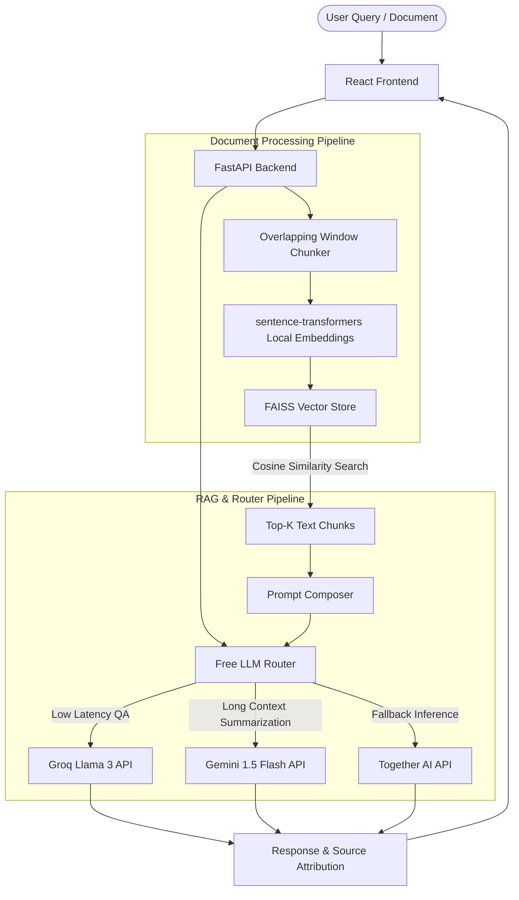

# DocuMind — AI Document Intelligence Platform

DocuMind is a production-grade, self-hosted AI Document Intelligence platform. It allows users to upload complex documents (PDFs, contracts, academic papers), ask questions, extract insights, and compare documents. 

To demonstrate true engineering rigor, DocuMind features a custom **Free LLM Router** that dynamically routes requests to the best available free tier API (Groq, Gemini, Together AI) and builds a completely **"Whitebox" RAG pipeline** that displays text chunks, embedding similarity scores, and source attribution directly to the user.

---

## 🏗️ System Architecture

---

## 🛠️ Technology Stack

| Layer | Tool | Rationale | Cost |
|---|---|---|---|
| **Frontend** | React + Tailwind CSS | Rapid UI prototyping, stateful panel management | $0 |
| **Backend** | FastAPI (Python) | High-performance asynchronous API, fast auto-generated docs | $0 |
| **Local Embeddings** | `sentence-transformers` | Runs locally (`all-MiniLM-L6-v2`), zero external API latency/costs | $0 |
| **Vector DB** | FAISS | Fast, in-memory dense vector similarity search | $0 |
| **Reasoning Engine** | Groq, Gemini 1.5, Together AI | Leverages free tier API limits with automatic failover | $0 |

---

## 🧠 Core AI Engineering Concepts (Mastery Path)

This project is built from first principles to ensure mastery of both **blackbox** integrations and **whitebox** implementations:

### ⚪ Whitebox Concepts (Built from Scratch)
* **Text Chunking:** Splitting documents into overlapping token-aware windows (512 tokens, 50-token overlap) to preserve context.
* **Dense Vectors & Embeddings:** Mapping text chunks to high-dimensional space (384/768 dimensions) using local transformers.
* **Vector Similarity Math:** Calculating proximity via Cosine Similarity:
  $$\text{Similarity}(A, B) = \frac{A \cdot B}{\|A\| \|B\|}$$
* **Confidence Scoring:** Interpreting cosine distance values into qualitative confidence ratings (High, Medium, Low).
* **Hallucination Detection:** Building post-inference validation checks to ensure generated answers are mathematically grounded in retrieved context chunks.

### ⚫ Blackbox Concepts (API Orchestration)
* **LLM Inference:** Consuming remote API endpoints, understanding token generation, and temperature/sampling parameters.
* **API Rate Limiting & Failover:** Handling `HTTP 429` errors by implementing exponential backoff and routing request fallback paths.

---

## 🗺️ Git Branching & Learning Roadmap

Development follows a strict branch-based development cycle to simulate professional production environments:

* `main`: Stable documentation and system blueprints.
* [`feature/phase-1-core-rag`](https://github.com/sangambaral17/DocuMind/tree/feature/phase-1-core-rag): PDF parsing, sentence-transformers, FAISS vector index creation, and the first working RAG pipeline.
* [`feature/phase-2-whitebox-ui`](https://github.com/sangambaral17/DocuMind/tree/feature/phase-2-whitebox-ui): Interactive UI dashboard with visual chunk highlight mapping, confidence metrics, and prompt inspection panels.
* [`feature/phase-3-llm-router`](https://github.com/sangambaral17/DocuMind/tree/feature/phase-3-llm-router): Dynamic router class, failover chains, and rate-limit tracking.
* [`feature/phase-4-agentic-rag`](https://github.com/sangambaral17/DocuMind/tree/feature/phase-4-agentic-rag): Multi-document comparison agent and structured JSON red-flag detector.
* [`feature/phase-5-eval-polish`](https://github.com/sangambaral17/DocuMind/tree/feature/phase-5-eval-polish): RAGAS evaluation suite, response caching, and database storage.

---

## 🚀 Getting Started

Instructions for running locally will be updated as soon as the respective core structures are built out in Phase 1.
